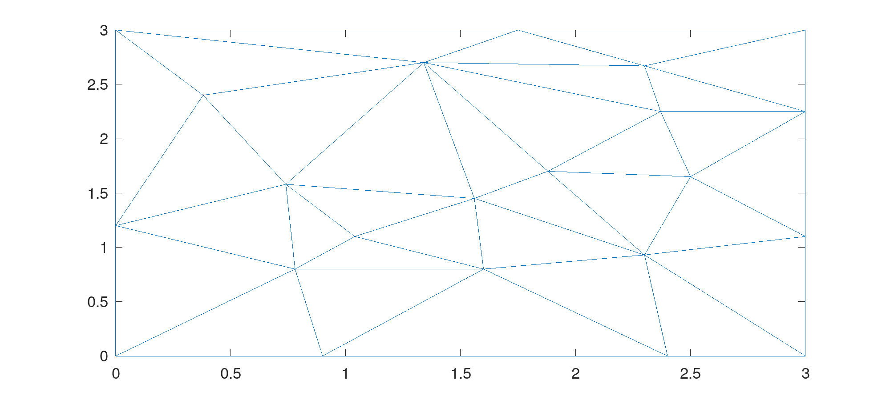
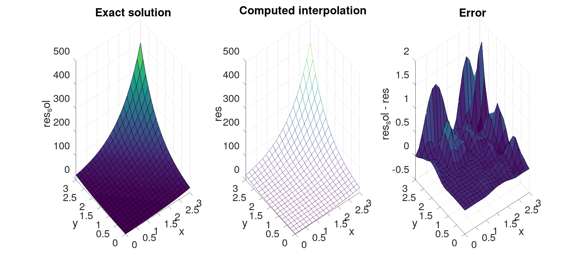
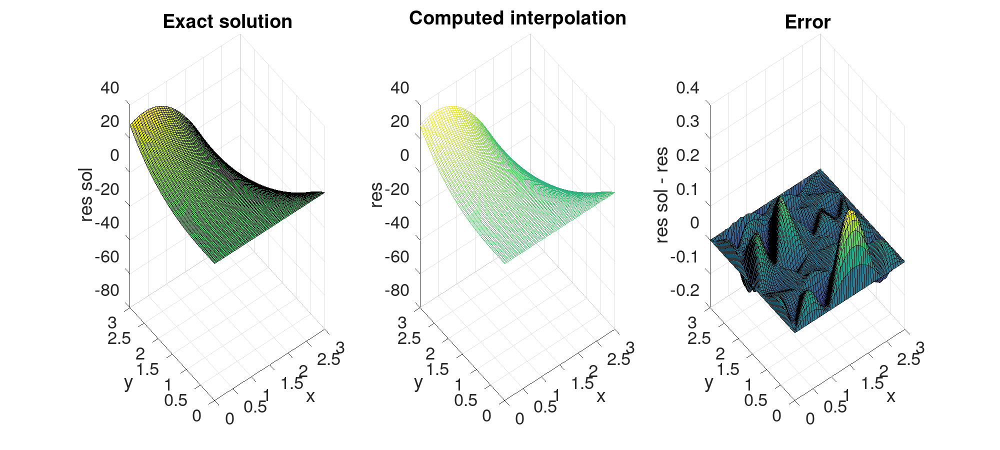

# $C^1$ surface interpolation, using reduced HCT elements

This tool computes a smooth surface (of class $C^1$) interpolation of a function using a set of control points in space. Matlab/Octave is used to compute the triangulation of the control points and to create the mesh used for interpolation.

## Usage

### Setting the input parameters:
 - control points are set in `data/hctr.pts`
 - $f:\mathbb{R}^2 \rightarrow \mathbb{R}$ , $\frac{\partial f}{\partial x}$ and $\frac{\partial f}{\partial y}$ are implemented in `src/Func.xpp`. To use those implemented functions, simply modify the header of `main.cpp`.

		```c++
	...
	float TestFunction(Point p){
		// SET FUNCTION HERE
		return f(p);
	}
	float dxTestFunction(Point p){
		// SET dx FUNCTION HERE
		return dxf(p);
	}
	
	float dyTestFunction(Point p){
		// SET dy FUNCTION HERE
		return dyf(p);
	}
	...
	```
 - The resolution of the interpolation mesh is specified directly in the main Matlab script `maim.m`. By default, `res_x = 50` and `res_y = 50`.

### Running the program
To obtain all results, simply run the main Matlab/Octave script `main.m`.

If you wish to run the C++ code on it's own, run

```bash
	./launch.sh <nb_triangles> <res_x> <res_y>
```

## Results
### Triangulation



### Interpolated surface
- **Example 1**:

$f:(x,y) \mapsto e^{x+y}$, `res_x = res_y = 20` 



- **Example 2**:

$f:(x,y) \mapsto y^3 - 2 x y^2 - 5 x^2 y + 10 x y + 1$, `res_x = 50, res_y = 100`


